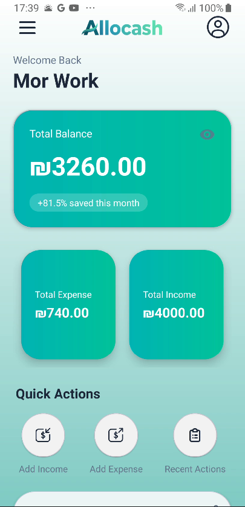
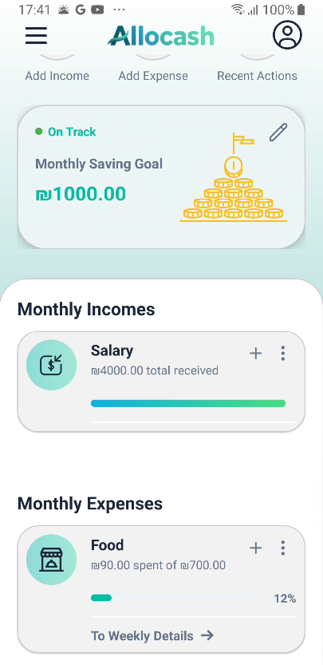
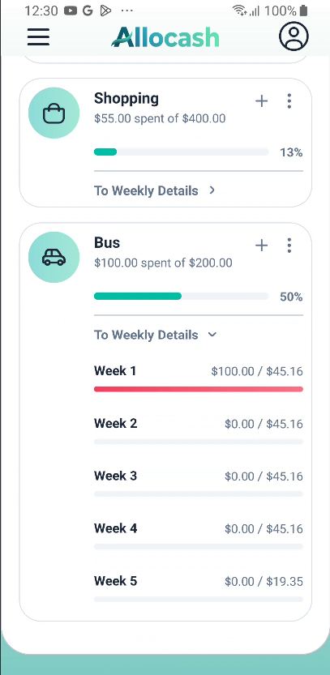
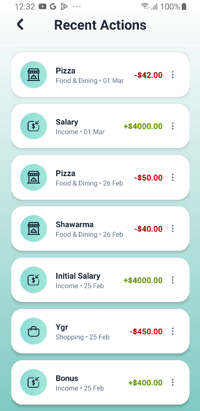
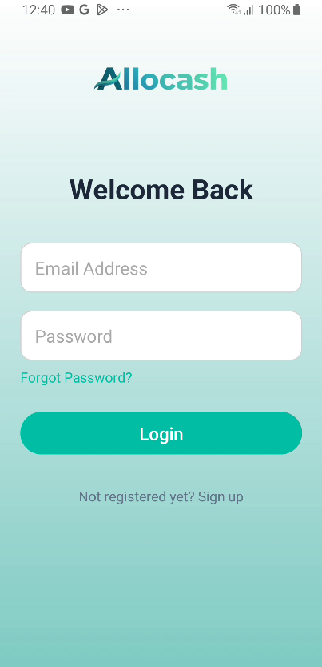
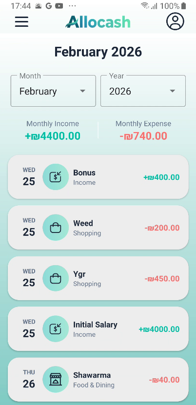
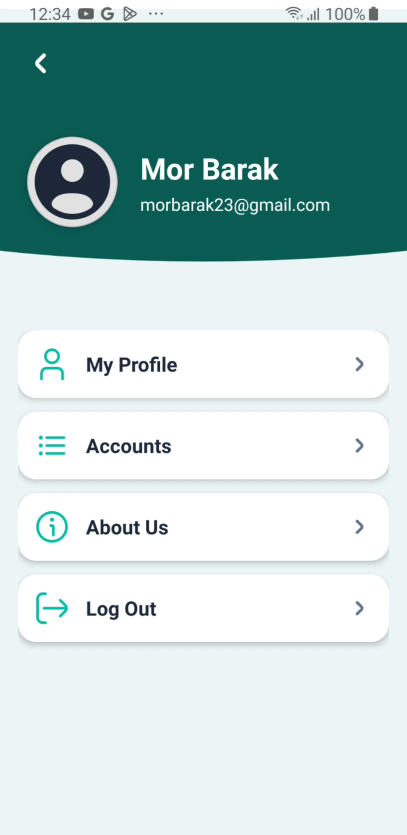
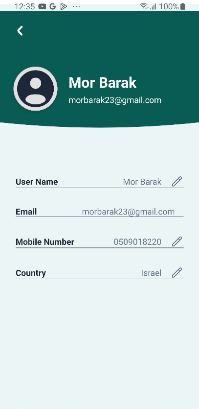
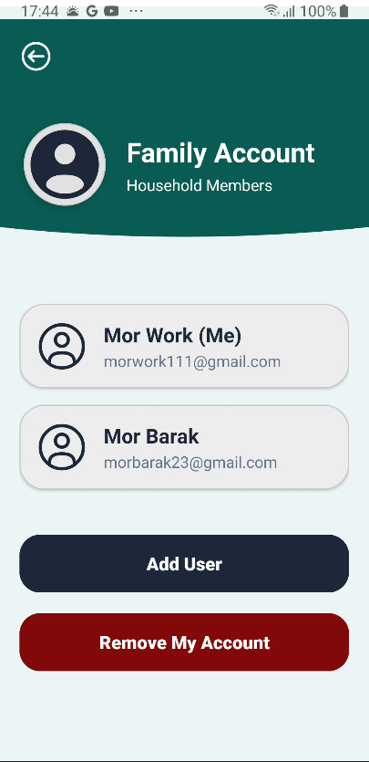
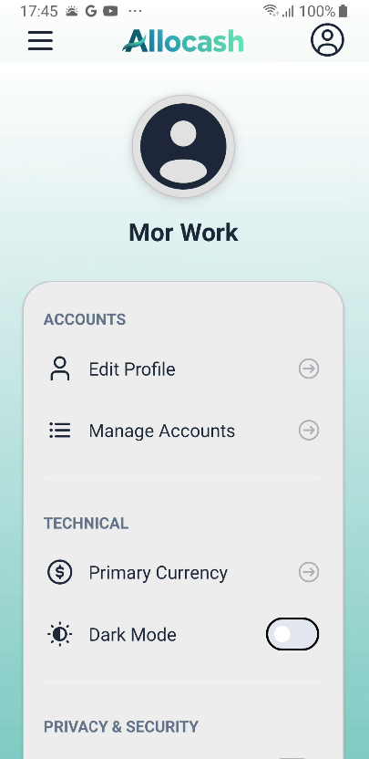

# Allocash - Smart Family Financial Assistant 💰

**Allocash** is a comprehensive, high-performance Android application designed to revolutionize how individuals and families manage their finances. Developed with a focus on real-time synchronization, intuitive UX, and data-driven insights.

---

## 🚀 The Vision & Problem Solver
Managing daily expenses and family budgets is often scattered across multiple apps or messy spreadsheets. **Allocash** solves this by providing:
* **Unified Financial View:** See your total balance, monthly savings rate, and budget goals in one place.
* **Family Transparency:** Real-time synchronization between family members using a shared cloud-based infrastructure.
* **Proactive Budgeting:** Move from passive tracking to active planning with automated monthly resets and goal-tracking indicators.

---

## ✨ Core Features

### 💎 Smart Dashboard
* **Privacy Mode:** Securely hide your balance in public with a single tap, replacing amounts with bullet points.
* **Dynamic Savings Rate:** Real-time calculation of your savings percentage relative to total income.
* **Monthly Goal Tracker:** Set a customized monthly savings goal with a visual "On Track" status indicator.

### 👨‍👩‍👧‍👦 Family Collaboration
* **Invitation System:** Securely invite family members via email with a pending acceptance workflow.
* **Cloud Sync:** Instant updates across all devices within the same family group ID.
* **Currency Synchronization:** Unified currency settings for all household members.

### 📊 Advanced Transaction Management
* **Weekly Breakdown:** Intelligent algorithms that slice monthly budgets into weekly targets to ensure you never overspend.
* **Categorized Tracking:** Separate management for Incomes and Expenses with customizable budget limits.
* **72-Hour Quick View:** Instant access to the most recent transactions to keep your daily spending in check.
* **Automated Monthly Reset:** On the first of every month, your spending totals reset while keeping your budget rows intact for a fresh start.

---

## ☁️ Cloud Architecture & Tech Stack
Allocash is built on a modern, scalable architecture:
* **Language:** Kotlin (100%) for robust, idiomatic Android development.
* **Backend:** Firebase Authentication for secure user management and Firestore for real-time, NoSQL document storage.
* **UI/UX:** Material Design 3, featuring full **Dark Mode** support and custom-styled dialog components.
* **Performance:** Optimized Firestore queries with composite indexing for high-speed data retrieval.

---

## 📸 Screenshots

 

   
  
  

  
  
  

  
  
  

  

---

## 🛠 Installation
1. Clone the repository.
2. Connect your Firebase project.
3. Add your `google-services.json`.
4. Build and Run.

---

## 👨‍💻 Developed By
**Mor Barak**
*CS Student*
Focused on building impactful, user-centric software solutions.

